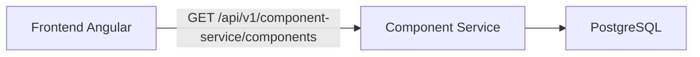
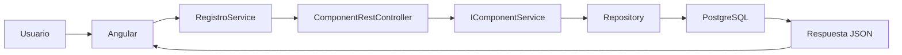
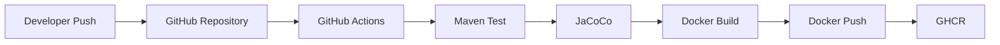
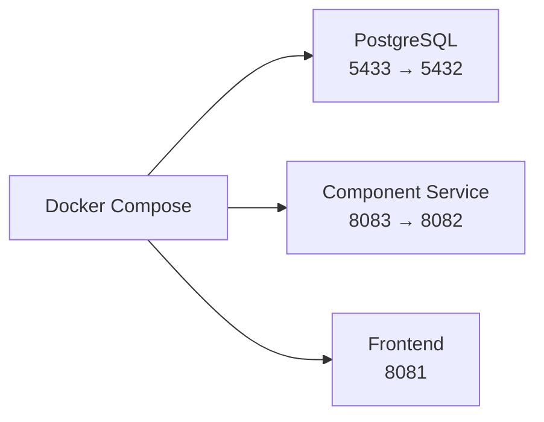

# TechPlanner2.0

Aplicación frontend construida con Angular para interactuar con el servicio de componentes y persistir datos en PostgreSQL a través de la arquitectura documentada en este repositorio.

## Arquitectura y Flujo CI/CD

### Arquitectura General



Este diagrama resume la relación principal de la solución: el frontend Angular consume el endpoint de lectura expuesto por el servicio de componentes y el backend persiste o consulta datos en PostgreSQL.

### Flujo de Ejecución



Este flujo describe la ruta completa de una solicitud desde la interacción del usuario hasta la respuesta del backend, incluyendo el acceso a la base de datos y el retorno de la respuesta en formato JSON al frontend.

### Flujo GitHub Actions



Este flujo documenta el ciclo de integración y entrega continua: el código se valida con pruebas Maven, se mide cobertura con JaCoCo y, si todo es correcto, se construye y publica la imagen Docker en GHCR.

### Flujo Docker Compose



Este diagrama representa el levantamiento conjunto de los servicios locales. Docker Compose expone PostgreSQL, el servicio de componentes y el frontend con los mapeos de puerto utilizados por la solución.

## Ejecución local

Para iniciar el frontend en desarrollo:

```bash
npm start
```

Para compilar la aplicación:

```bash
npm run build
```

Para ejecutar las pruebas unitarias:

```bash
npm test
```

## Notas

La documentación anterior se limita a los flujos y puertos observables en el repositorio y en la configuración de contenedores incluida en este proyecto.
